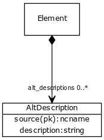

# Class: alt_description

an attributed description

URI: [http://w3id.org/biolink/biolinkml/meta/AltDescription](http://w3id.org/biolink/biolinkml/meta/AltDescription)

## Inheritance

## Children

## Used by

 *  **[Element](Element.md)** *[alt_descriptions](alt_descriptions.md)*  0..*  **[AltDescription](AltDescription.md)**
## Fields

 * [alt_description.source](alt_description_source.md)  REQ
    * Description: the source of an attributed description
    * range: [Ncname](Ncname.md)
 * [alt_description.description](alt_description_text.md)  REQ
    * Description: text of an attributed description
    * range: [String](String.md)
