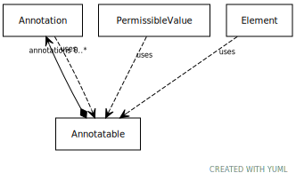

# Type: annotatable

mixin for classes that support annotations

URI: [meta:Annotatable](https://w3id.org/biolink/biolinkml/meta/Annotatable)

## Mixin for

 * [Element](Element.md) (mixin)  - a named element in the model

## Referenced by class

## Attributes

### Own

 * [annotations](annotations.md)  0..*
    * Description: a collection of tag/text tuples with the semantics of OWL Annotation
    * range: [Annotation](Annotation.md)
