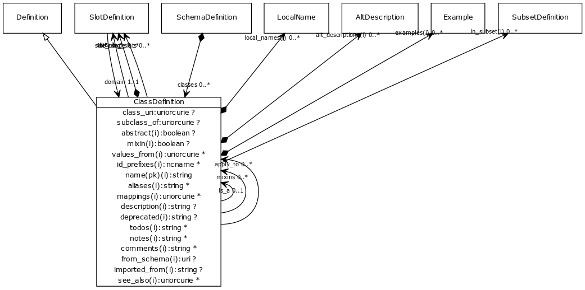

# Class: class definition

the definition of a class or interface

URI: [http://w3id.org/biolink/biolinkml/meta/ClassDefinition](http://w3id.org/biolink/biolinkml/meta/ClassDefinition)

## Inheritance

 *  is_a: [Definition](Definition.md) - base class for definitions
## Children

## Used by

 *  **[ClassDefinition](ClassDefinition.md)** *[class definition.apply_to](class_definition_apply_to.md)opt*  **[[ClassDefinition](ClassDefinition.md)]**
 *  **[ClassDefinition](ClassDefinition.md)** *[class definition.is_a](class_definition_is_a.md)opt*  **[ClassDefinition](ClassDefinition.md)**
 *  **[ClassDefinition](ClassDefinition.md)** *[class definition.mixins](class_definition_mixins.md)opt*  **[[ClassDefinition](ClassDefinition.md)]**
 *  **[SchemaDefinition](SchemaDefinition.md)** *[classes](classes.md)opt*  **[[ClassDefinition](ClassDefinition.md)]**
 *  **[SlotDefinition](SlotDefinition.md)** *[domain](domain.md)*  **[ClassDefinition](ClassDefinition.md)**
## Fields

 * [abstract](abstract.md)opt
    * Description: an abstract class is a high level class or slot that is typically used to group common slots together and cannot be directly instantiated.
    * range: [Boolean](Boolean.md)
    * inherited from: [Definition](Definition.md)
 * [aliases](aliases.md)opt
    * range: [[String](String.md)]
    * inherited from: [Element](Element.md)
 * [class definition.apply_to](class_definition_apply_to.md)opt
    * Description: Used to extend class or slot definitions. For example, if we have a core schema where a gene has two slots for identifier and symbol, and we have a specialized schema for my_organism where we wish to add a slot systematic_name, we can avoid subclassing by defining a class gene_my_organism, adding the slot to this class, and then adding an apply_to pointing to the gene class. The new slot will be 'injected into' the gene class.
    * range: [[ClassDefinition](ClassDefinition.md)]
 * [class definition.is_a](class_definition_is_a.md)opt
    * Description: specifies single-inheritance between classes or slots. While multiple inheritance is not allowed, mixins can be provided effectively providing the same thing. The semantics are the same when translated to formalisms that allow MI (e.g. RDFS/OWL). When translating to a SI framework (e.g. java classes, python classes) then is_a is used. When translating a framework without polymorphism (e.g. json-schema, solr document schema) then is_a and mixins are recursively unfolded
    * range: [ClassDefinition](ClassDefinition.md)
 * [class definition.mixins](class_definition_mixins.md)opt
    * Description: List of definitions to be mixed in. Targets may be any definition of the same type
    * range: [[ClassDefinition](ClassDefinition.md)]
 * [class_uri](class_uri.md)opt
    * Description: URI of the class in an RDF environment
    * range: [Uri](Uri.md)
 * [comments](comments.md) *subsets*: (owl)opt
    * Description: notes and comments about an element intended for external consumption
    * range: [[String](String.md)]
    * inherited from: [Element](Element.md)
 * [defining_slots](defining_slots.md)opt
    * Description: The combination of is_a plus defining slots form a genus-differentia definition, or the set of necessary and sufficient conditions that can be transformed into an OWL equivalence axiom
    * range: [[SlotDefinition](SlotDefinition.md)]
 * [deprecated](deprecated.md)opt
    * Description: Description of why and when this element will no longer be used
    * range: [String](String.md)
    * inherited from: [Element](Element.md)
 * [description](description.md) *subsets*: (owl)opt
    * Description: a description of the element's purpose and use
    * range: [String](String.md)
    * inherited from: [Element](Element.md)
 * [examples](examples.md) *subsets*: (owl)opt
    * Description: example usages of an element
    * range: [[Example](Example.md)]
    * inherited from: [Element](Element.md)
 * [from_schema](from_schema.md)opt
    * Description: id of the schema that defined the element
    * range: [SchemaDefinition](SchemaDefinition.md)
    * inherited from: [Element](Element.md)
 * [id_prefixes](id_prefixes.md)opt
    * Description: a list of Curie prefixes that are used in the representation of instances of the model.  All prefixes in this list are added to the prefix sections of the target models.
    * range: [[Ncname](Ncname.md)]
    * inherited from: [Element](Element.md)
 * [in_subset](in_subset.md)opt
    * Description: used to indicate membership of a term in a defined subset of biolink terms used for a particular domain or application (e.g. the translator_minimal subset holding the minimal set of predicates used in a translator knowledge graph)
    * range: [[SubsetDefinition](SubsetDefinition.md)]
    * inherited from: [Element](Element.md)
 * [local_names](local_names.md)opt
    * Description: map from local identifier to slot
    * range: [[String](String.md)]
    * inherited from: [Definition](Definition.md)
 * [mappings](mappings.md)opt
    * Description: A list of terms from different schemas or terminology systems that have comparable meaning. These may include terms that are precisely equivalent, broader or narrower in meaning, or otherwise semantically related but not equivalent from a strict ontological perspective.
    * range: [[Uri](Uri.md)]
    * inherited from: [Element](Element.md)
 * [mixin](mixin.md)opt
    * Description: this slot or class can only be used as a mixin -- equivalent to abstract
    * range: [Boolean](Boolean.md)
    * inherited from: [Definition](Definition.md)
 * [name](name.md) *subsets*: (owl)
    * Description: the unique name of the element within the context of the schema
    * range: [String](String.md)
    * inherited from: [Element](Element.md)
 * [notes](notes.md) *subsets*: (owl)opt
    * Description: editorial notes about an element intended for internal consumption
    * range: [[String](String.md)]
    * inherited from: [Element](Element.md)
 * [see_also](see_also.md) *subsets*: (owl)opt
    * Description: a reference
    * range: [[Uri](Uri.md)]
    * inherited from: [Element](Element.md)
 * [slot_usage](slot_usage.md)opt
    * Description: the redefinition of a slot in the context of the containing class definition.
    * range: [[SlotDefinition](SlotDefinition.md)]
 * [slots](slots.md)opt
    * Description: list of slot names that are applicable to a class
    * range: [[SlotDefinition](SlotDefinition.md)]
 * [subclass_of](subclass_of.md)opt
    * Description: instances of this class are considered/required to be sub classes of the target URI
    * range: [Uri](Uri.md)
 * [values_from](values_from.md)opt
    * Description: identifies the possible uri's of the range
    * range: [[Uri](Uri.md)]
    * inherited from: [Definition](Definition.md)
