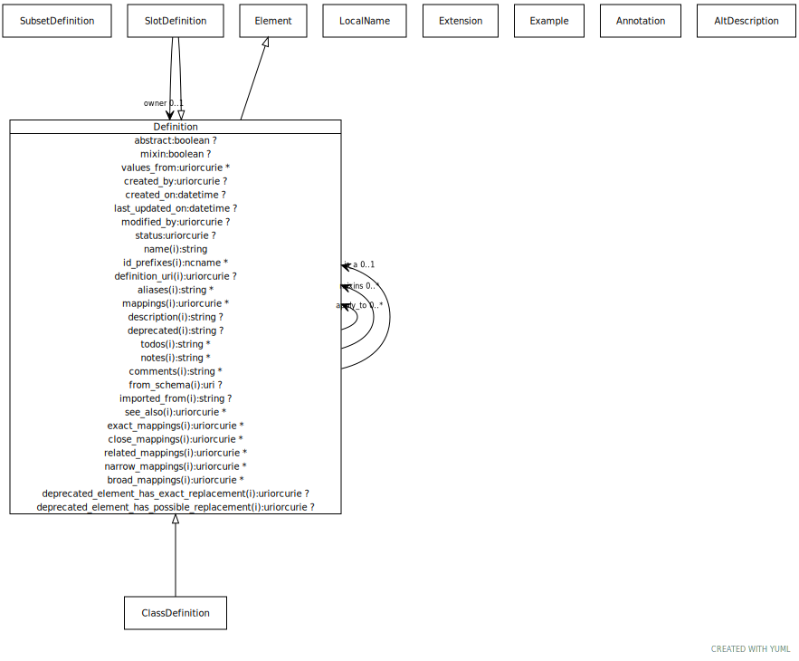

# Type: definition

base class for definitions

URI: [meta:Definition](https://w3id.org/biolink/biolinkml/meta/Definition)

## Parents

 *  is_a: [Element](Element.md) - a named element in the model

## Children

 * [ClassDefinition](ClassDefinition.md) - the definition of a class or interface
 * [SlotDefinition](SlotDefinition.md) - the definition of a property or a slot

## Referenced by class

 *  **[Definition](Definition.md)** *[apply_to](apply_to.md)*  0..*  **[Definition](Definition.md)**
 *  **[Definition](Definition.md)** *[is_a](is_a.md)*  OPT  **[Definition](Definition.md)**
 *  **[Definition](Definition.md)** *[mixins](mixins.md)*  0..*  **[Definition](Definition.md)**
 *  **[SlotDefinition](SlotDefinition.md)** *[owner](owner.md)*  OPT  **[Definition](Definition.md)**

## Attributes

### Own

 * [abstract](abstract.md)  OPT
    * Description: an abstract class is a high level class or slot that is typically used to group common slots together and cannot be directly instantiated.
    * range: [Boolean](types/Boolean.md)
 * [apply_to](apply_to.md)  0..*
    * Description: Used to extend class or slot definitions. For example, if we have a core schema where a gene has two slots for identifier and symbol, and we have a specialized schema for my_organism where we wish to add a slot systematic_name, we can avoid subclassing by defining a class gene_my_organism, adding the slot to this class, and then adding an apply_to pointing to the gene class. The new slot will be 'injected into' the gene class.
    * range: [Definition](Definition.md)
 * [created_by](created_by.md)  OPT
    * Description: agent that created the element
    * range: [Uriorcurie](types/Uriorcurie.md)
 * [created_on](created_on.md)  OPT
    * Description: time at which the element was created
    * range: [Datetime](types/Datetime.md)
 * [is_a](is_a.md)  OPT
    * Description: specifies single-inheritance from a class to a class or a slot to a slot
    * range: [Definition](Definition.md)
 * [last_updated_on](last_updated_on.md)  OPT
    * Description: time at which the element was last updated
    * range: [Datetime](types/Datetime.md)
 * [mixin](mixin.md)  OPT
    * Description: If a class or slot has this property then it can contain properties that can be inherited via `mixins` declarations
    * range: [Boolean](types/Boolean.md)
 * [mixins](mixins.md)  0..*
    * Description: List of definitions to be mixed in (inherited). Targets may be any definition of the same type
    * range: [Definition](Definition.md)
 * [modified_by](modified_by.md)  OPT
    * Description: agent that modified the element
    * range: [Uriorcurie](types/Uriorcurie.md)
 * [status](status.md)  OPT
    * Description: status of the element
    * range: [Uriorcurie](types/Uriorcurie.md)
    * Example: bibo:draft None
 * [values_from](values_from.md)  0..*
    * Description: the identifier of a "value set" -- a set of identifiers that form the possible values for the range of a slot
    * range: [Uriorcurie](types/Uriorcurie.md)

### Inherited from element:

 * [aliases](aliases.md)  0..*
    * Description: alternate name for the element
    * range: [String](types/String.md)
    * in subsets: (descriptive)
 * [alt_descriptions](alt_descriptions.md)  0..*
    * range: [AltDescription](AltDescription.md)
 * [broad mappings](broad_mappings.md)  0..*
    * Description: A list of terms from different schemas or terminology systems that have broader meaning.
    * range: [Uriorcurie](types/Uriorcurie.md)
 * [close mappings](close_mappings.md)  0..*
    * Description: A list of terms from different schemas or terminology systems that have close meaning.
    * range: [Uriorcurie](types/Uriorcurie.md)
 * [comments](comments.md)  0..*
    * Description: notes and comments about an element intended for external consumption
    * range: [String](types/String.md)
    * in subsets: (owl)
 * [definition_uri](definition_uri.md)  OPT
    * Description: the "native" URI of the element
    * range: [Uriorcurie](types/Uriorcurie.md)
 * [deprecated](deprecated.md)  OPT
    * Description: Description of why and when this element will no longer be used
    * range: [String](types/String.md)
 * [deprecated element has exact replacement](deprecated_element_has_exact_replacement.md)  OPT
    * Description: When an element is deprecated, it can be automatically replaced by this uri or curie
    * range: [Uriorcurie](types/Uriorcurie.md)
 * [deprecated element has possible replacement](deprecated_element_has_possible_replacement.md)  OPT
    * Description: When an element is deprecated, it can be potentially replaced by this uri or curie
    * range: [Uriorcurie](types/Uriorcurie.md)
 * [description](description.md)  OPT
    * Description: a description of the element's purpose and use
    * range: [String](types/String.md)
    * in subsets: (owl,descriptive)
 * [exact mappings](exact_mappings.md)  0..*
    * Description: A list of terms from different schemas or terminology systems that have identical meaning.
    * range: [Uriorcurie](types/Uriorcurie.md)
 * [examples](examples.md)  0..*
    * Description: example usages of an element
    * range: [Example](Example.md)
    * in subsets: (owl)
 * [from_schema](from_schema.md)  OPT
    * Description: id of the schema that defined the element
    * range: [Uri](types/Uri.md)
 * [id_prefixes](id_prefixes.md)  0..*
    * Description: the identifier of this class or slot _should_ begin with one of the URIs referenced by this prefix
    * range: [Ncname](types/Ncname.md)
 * [imported_from](imported_from.md)  OPT
    * Description: the imports entry that this element was derived from.  Empty means primary source
    * range: [String](types/String.md)
 * [in_subset](in_subset.md)  0..*
    * Description: used to indicate membership of a term in a defined subset of biolink terms used for a particular domain or application (e.g. the translator_minimal subset holding the minimal set of predicates used in a translator knowledge graph)
    * range: [SubsetDefinition](SubsetDefinition.md)
 * [local_names](local_names.md)  0..*
    * range: [LocalName](LocalName.md)
 * [mappings](mappings.md)  0..*
    * Description: A list of terms from different schemas or terminology systems that have comparable meaning. These may include terms that are precisely equivalent, broader or narrower in meaning, or otherwise semantically related but not equivalent from a strict ontological perspective.
    * range: [Uriorcurie](types/Uriorcurie.md)
 * [name](name.md)  REQ
    * Description: the unique name of the element within the context of the schema.  Name is combined with the default prefix to form the globally unique subject of the target class.
    * range: [String](types/String.md)
    * in subsets: (owl)
 * [narrow mappings](narrow_mappings.md)  0..*
    * Description: A list of terms from different schemas or terminology systems that have narrower meaning.
    * range: [Uriorcurie](types/Uriorcurie.md)
 * [notes](notes.md)  0..*
    * Description: editorial notes about an element intended for internal consumption
    * range: [String](types/String.md)
    * in subsets: (owl)
 * [related mappings](related_mappings.md)  0..*
    * Description: A list of terms from different schemas or terminology systems that have related meaning.
    * range: [Uriorcurie](types/Uriorcurie.md)
 * [see_also](see_also.md)  0..*
    * Description: a reference
    * range: [Uriorcurie](types/Uriorcurie.md)
    * in subsets: (owl)
 * [string_template](string_template.md)  OPT
    * Description: A formatting string to represent the element.  If present, string_template is used whenever the string representation of the element and will also result in the addition of a `parse` method in the containing python class that will allow instances to be added through string parsing
    * range: [String](types/String.md)
 * [todos](todos.md)  0..*
    * Description: Outstanding issue that needs resolution
    * range: [String](types/String.md)
    * in subsets: (descriptive)

## Other properties

|  |  |  |
| --- | --- | --- |
| **See also:** | | https://en.wikipedia.org/wiki/Data_element_definition |

