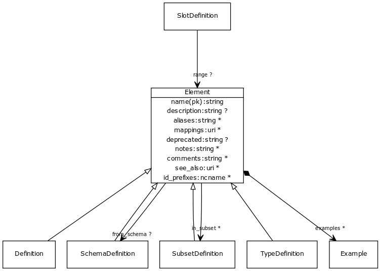

# Class: element

a named element in the model

URI: [http://w3id.org/biolink/biolinkml/meta/Element](http://w3id.org/biolink/biolinkml/meta/Element)

## Inheritance

## Children

 * [Definition](Definition.md) - base class for definitions
 * [SchemaDefinition](SchemaDefinition.md) - a collection of subset, type, slot and class definitions
 * [SubsetDefinition](SubsetDefinition.md) - the name and description of a subset
 * [TypeDefinition](TypeDefinition.md) - A data type definition.
## Used by

 *  **[SlotDefinition](SlotDefinition.md)** *[range](range.md)opt*  **[Element](Element.md)**
## Fields

 * [aliases](aliases.md)opt
    * range: [[String](String.md)]
 * [comments](comments.md) *subsets*: (owl)opt
    * Description: notes and comments about an element intended for external consumption
    * range: [[String](String.md)]
 * [deprecated](deprecated.md)opt
    * Description: Description of why and when this element will no longer be used
    * range: [String](String.md)
 * [description](description.md) *subsets*: (owl)opt
    * Description: a description of the element's purpose and use
    * range: [String](String.md)
 * [examples](examples.md) *subsets*: (owl)opt
    * Description: example usages of an element
    * range: [[Example](Example.md)]
 * [from_schema](from_schema.md)opt
    * Description: id of the schema that defined the element
    * range: [SchemaDefinition](SchemaDefinition.md)
 * [id_prefixes](id_prefixes.md)opt
    * Description: a list of Curie prefixes that are used in the representation of instances of the model.  All prefixes in this list are added to the prefix sections of the target models.
    * range: [[Ncname](Ncname.md)]
 * [in_subset](in_subset.md)opt
    * Description: used to indicate membership of a term in a defined subset of biolink terms used for a particular domain or application (e.g. the translator_minimal subset holding the minimal set of predicates used in a translator knowledge graph)
    * range: [[SubsetDefinition](SubsetDefinition.md)]
 * [mappings](mappings.md)opt
    * Description: A list of terms from different schemas or terminology systems that have comparable meaning. These may include terms that are precisely equivalent, broader or narrower in meaning, or otherwise semantically related but not equivalent from a strict ontological perspective.
    * range: [[Uri](Uri.md)]
 * [name](name.md) *subsets*: (owl)
    * Description: the unique name of the element within the context of the schema
    * range: [String](String.md)
 * [notes](notes.md) *subsets*: (owl)opt
    * Description: editorial notes about an element intended for internal consumption
    * range: [[String](String.md)]
 * [see_also](see_also.md) *subsets*: (owl)opt
    * Description: a reference
    * range: [[Uri](Uri.md)]
