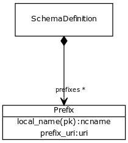

# Class: prefix

prefix URI tuple

URI: [http://w3id.org/biolink/biolinkml/meta/Prefix](http://w3id.org/biolink/biolinkml/meta/Prefix)

## Inheritance

## Children

## Used by

 *  **[SchemaDefinition](SchemaDefinition.md)** *[prefixes](prefixes.md)opt*  **[[Prefix](Prefix.md)]**
## Fields

 * [local name](local_name.md)
    * Description: the nsname (sans ':' for a given prefix)
    * range: [Ncname](Ncname.md)
 * [prefix uri](prefix_uri.md)
    * Description: A URI associated with a given prefix
    * range: [Uri](Uri.md)
