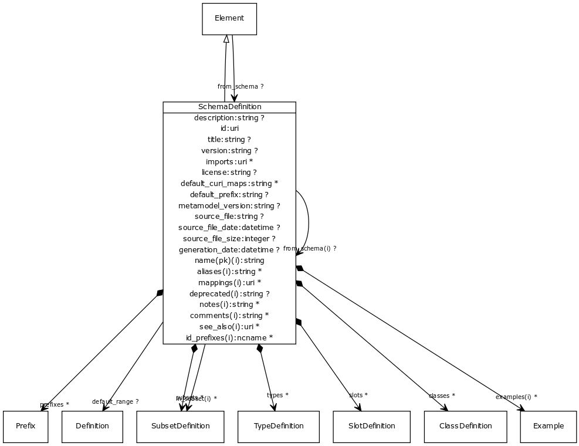

# Class: schema definition

a collection of subset, type, slot and class definitions

URI: [http://w3id.org/biolink/biolinkml/meta/SchemaDefinition](http://w3id.org/biolink/biolinkml/meta/SchemaDefinition)

## Inheritance

 *  is_a: [Element](Element.md) - a named element in the model
## Children

## Used by

 *  **[Element](Element.md)** *[from_schema](from_schema.md)opt*  **[SchemaDefinition](SchemaDefinition.md)**
## Fields

 * [aliases](aliases.md)opt
    * range: [[String](String.md)]
    * inherited from: [Element](Element.md)
 * [classes](classes.md)opt
    * Description: class definitions
    * range: [[ClassDefinition](ClassDefinition.md)]
 * [comments](comments.md) *subsets*: (owl)opt
    * Description: notes and comments about an element intended for external consumption
    * range: [[String](String.md)]
    * inherited from: [Element](Element.md)
 * [default_curi_maps](default_curi_maps.md)opt
    * Description: ordered list of prefixcommon biocontexts to be fetched to resolve id_prefixes and inline prefix variables
    * range: [[String](String.md)]
 * [default_prefix](default_prefix.md)opt
    * Description: default and base prefix -- used for ':' identifiers, @base and @vocab
    * range: [String](String.md)
 * [default_range](default_range.md)opt
    * Description: default slot range to be used if range element is omitted from a slot definition
    * range: [Definition](Definition.md)
 * [deprecated](deprecated.md)opt
    * Description: Description of why and when this element will no longer be used
    * range: [String](String.md)
    * inherited from: [Element](Element.md)
 * [examples](examples.md) *subsets*: (owl)opt
    * Description: example usages of an element
    * range: [[Example](Example.md)]
    * inherited from: [Element](Element.md)
 * [from_schema](from_schema.md)opt
    * Description: id of the schema that defined the element
    * range: [SchemaDefinition](SchemaDefinition.md)
    * inherited from: [Element](Element.md)
 * [generation_date](generation_date.md) *subsets*: (owl)opt
    * Description: date and time that the schema was loaded/generated
    * range: [Datetime](Datetime.md)
 * [id](id.md)
    * Description: a globally unique schema identifier
    * range: [Uri](Uri.md)
 * [id_prefixes](id_prefixes.md)opt
    * Description: a list of Curie prefixes that are used in the representation of instances of the model.  All prefixes in this list are added to the prefix sections of the target models.
    * range: [[Ncname](Ncname.md)]
    * inherited from: [Element](Element.md)
 * [imports](imports.md)opt
    * Description: other schemas that are included in this schema
    * range: [[Uri](Uri.md)]
 * [in_subset](in_subset.md)opt
    * Description: used to indicate membership of a term in a defined subset of biolink terms used for a particular domain or application (e.g. the translator_minimal subset holding the minimal set of predicates used in a translator knowledge graph)
    * range: [[SubsetDefinition](SubsetDefinition.md)]
    * inherited from: [Element](Element.md)
 * [license](license.md) *subsets*: (owl)opt
    * Description: license for the schema
    * range: [String](String.md)
 * [mappings](mappings.md)opt
    * Description: A list of terms from different schemas or terminology systems that have comparable meaning. These may include terms that are precisely equivalent, broader or narrower in meaning, or otherwise semantically related but not equivalent from a strict ontological perspective.
    * range: [[Uri](Uri.md)]
    * inherited from: [Element](Element.md)
 * [metamodel_version](metamodel_version.md) *subsets*: (owl)opt
    * Description: Version of the metamodel used to load the schema
    * range: [String](String.md)
 * [name](name.md) *subsets*: (owl)
    * Description: the unique name of the element within the context of the schema
    * range: [String](String.md)
    * inherited from: [Element](Element.md)
 * [notes](notes.md) *subsets*: (owl)opt
    * Description: editorial notes about an element intended for internal consumption
    * range: [[String](String.md)]
    * inherited from: [Element](Element.md)
 * [prefixes](prefixes.md)opt
    * Description: prefix / URI definitions to be added to the context beyond those fetched from prefixcommons in id_prefixes
    * range: [[Prefix](Prefix.md)]
 * [schema definition.description](schema_definition_description.md)opt
    * Description: a description of the element's purpose and use
    * range: [String](String.md)
 * [see_also](see_also.md) *subsets*: (owl)opt
    * Description: a reference
    * range: [[Uri](Uri.md)]
    * inherited from: [Element](Element.md)
 * [schema definition.slots](slot_definitions.md)opt
    * Description: slot definitions
    * range: [[SlotDefinition](SlotDefinition.md)]
 * [source_file](source_file.md) *subsets*: (owl)opt
    * Description: name, uri or description of the source of the schema
    * range: [String](String.md)
 * [source_file_date](source_file_date.md) *subsets*: (owl)opt
    * Description: modification date of the source of the schema
    * range: [Datetime](Datetime.md)
 * [source_file_size](source_file_size.md) *subsets*: (owl)opt
    * Description: size in bytes of the source of the schema
    * range: [Integer](Integer.md)
 * [subsets](subsets.md)opt
    * Description: list of subsets referenced in this model
    * range: [[SubsetDefinition](SubsetDefinition.md)]
 * [title](title.md) *subsets*: (owl)opt
    * Description: the official title of the schema
    * range: [String](String.md)
 * [types](types.md)opt
    * Description: data types used in the model
    * range: [[TypeDefinition](TypeDefinition.md)]
 * [version](version.md)opt
    * Description: particular version of schema
    * range: [String](String.md)
