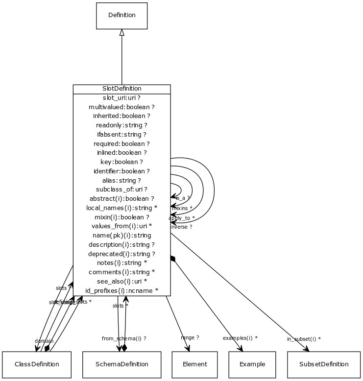

# Class: slot_definition

the definition of a property or a slot

URI: [http://w3id.org/biolink/biolinkml/meta/SlotDefinition](http://w3id.org/biolink/biolinkml/meta/SlotDefinition)

## Inheritance

 *  is_a: [Definition](Definition.md) - base class for definitions
## Children

## Used by

 *  **[ClassDefinition](ClassDefinition.md)** *[defining_slots](defining_slots.md)*  0..*  **[SlotDefinition](SlotDefinition.md)**
 *  **[SlotDefinition](SlotDefinition.md)** *[slot_definition.apply_to](slot_definition_apply_to.md)*  0..*  **[SlotDefinition](SlotDefinition.md)**
 *  **[SlotDefinition](SlotDefinition.md)** *[slot_definition.is_a](slot_definition_is_a.md)*  OPT  **[SlotDefinition](SlotDefinition.md)**
 *  **[SlotDefinition](SlotDefinition.md)** *[slot_definition.mixins](slot_definition_mixins.md)*  0..*  **[SlotDefinition](SlotDefinition.md)**
 *  **[SchemaDefinition](SchemaDefinition.md)** *[schema_definition.slots](slot_definitions.md)*  0..*  **[SlotDefinition](SlotDefinition.md)**
 *  **[ClassDefinition](ClassDefinition.md)** *[slot_usage](slot_usage.md)*  0..*  **[SlotDefinition](SlotDefinition.md)**
 *  **[ClassDefinition](ClassDefinition.md)** *[slots](slots.md)*  0..*  **[SlotDefinition](SlotDefinition.md)**
## Fields

 * [abstract](abstract.md)  OPT
    * Description: an abstract class is a high level class or slot that is typically used to group common slots together and cannot be directly instantiated.
    * range: [Boolean](Boolean.md)
    * inherited from: [Definition](Definition.md)
 * [alias](alias.md)  OPT
    * Description: the name used for a slot in the context of its owning class.  If present, this is used instead of the actual slot name.
    * range: [String](String.md)
 * [aliases](aliases.md)  0..*
    * range: [String](String.md)
    * inherited from: [Element](Element.md)
 * [alt_descriptions](alt_descriptions.md)  0..*
    * range: [AltDescription](AltDescription.md)
    * inherited from: [Element](Element.md)
 * [comments](comments.md)  0..*
    * Description: notes and comments about an element intended for external consumption
    * range: [String](String.md)
    * inherited from: [Element](Element.md)
    * in subsets: (owl)
 * [deprecated](deprecated.md)  OPT
    * Description: Description of why and when this element will no longer be used
    * range: [String](String.md)
    * inherited from: [Element](Element.md)
 * [description](description.md)  OPT
    * Description: a description of the element's purpose and use
    * range: [String](String.md)
    * inherited from: [Element](Element.md)
    * in subsets: (owl)
 * [domain](domain.md)  REQ
    * Description: defines the type of the subject of the slot.  Given the following slot definition
  S1:
    domain: C1
    range:  C2
the declaration
  X:
    S1: Y

implicitly asserts that X is an instance of C1

    * range: [ClassDefinition](ClassDefinition.md)
 * [examples](examples.md)  0..*
    * Description: example usages of an element
    * range: [Example](Example.md)
    * inherited from: [Element](Element.md)
    * in subsets: (owl)
 * [from_schema](from_schema.md)  OPT
    * Description: id of the schema that defined the element
    * range: [Uri](Uri.md)
    * inherited from: [Element](Element.md)
 * [id_prefixes](id_prefixes.md)  0..*
    * Description: the identifier of this class or slot must begin with one of the URIs referenced by this prefix
    * range: [Ncname](Ncname.md)
    * inherited from: [Element](Element.md)
 * [identifier](identifier.md)  OPT
    * Description: true means that this slot is the subject of a set of assertions.  Identifiers do not appear as predicates in the model
    * range: [Boolean](Boolean.md)
 * [ifabsent](ifabsent.md)  OPT
    * Description: description of special behavior if the slot is absent
    * range: [String](String.md)
 * [imported_from](imported_from.md)  OPT
    * Description: the imports entry that this element was derived from.  Empty means primary source
    * range: [String](String.md)
    * inherited from: [Element](Element.md)
 * [in_subset](in_subset.md)  0..*
    * Description: used to indicate membership of a term in a defined subset of biolink terms used for a particular domain or application (e.g. the translator_minimal subset holding the minimal set of predicates used in a translator knowledge graph)
    * range: [SubsetDefinition](SubsetDefinition.md)
    * inherited from: [Element](Element.md)
 * [inherited](inherited.md)  OPT
    * Description: true means that the *value* of a slot is inherited by subclasses
    * range: [Boolean](Boolean.md)
 * [inlined](inlined.md)  OPT
    * Description: an inlined definition a list of actual values rather than references.  Only applies to slots whose range is a class.
    * range: [Boolean](Boolean.md)
 * [key](key.md)  OPT
    * Description: true means that the slot uniquely identifies the element within the context of its container.  Key slots are NOT identifiers - they do not serve as subjects
    * range: [Boolean](Boolean.md)
 * [local_names](local_names.md)  0..*
    * range: [LocalName](LocalName.md)
    * inherited from: [Element](Element.md)
 * [mappings](mappings.md)  0..*
    * Description: A list of terms from different schemas or terminology systems that have comparable meaning. These may include terms that are precisely equivalent, broader or narrower in meaning, or otherwise semantically related but not equivalent from a strict ontological perspective.
    * range: [Uriorcurie](Uriorcurie.md)
    * inherited from: [Element](Element.md)
 * [mixin](mixin.md)  OPT
    * Description: this slot or class can only be used as a mixin -- equivalent to abstract
    * range: [Boolean](Boolean.md)
    * inherited from: [Definition](Definition.md)
 * [multivalued](multivalued.md)  OPT
    * Description: true means that slot can have more than one value
    * range: [Boolean](Boolean.md)
 * [name](name.md)  REQ
    * Description: the unique name of the element within the context of the schema.  Name is combined with the default prefix to form the globally unique subject of the target class.
    * range: [String](String.md)
    * inherited from: [Element](Element.md)
    * in subsets: (owl)
 * [notes](notes.md)  0..*
    * Description: editorial notes about an element intended for internal consumption
    * range: [String](String.md)
    * inherited from: [Element](Element.md)
    * in subsets: (owl)
 * [range](range.md)  OPT
    * Description: defines the type of the object of the slot.  Given the following slot definition
  S1:
    domain: C1
    range:  C2
the declaration
  X:
    S1: Y

implicitly asserts Y is an instance of C2

    * range: [Element](Element.md)
 * [readonly](readonly.md)  OPT
    * Description: If present, slot is read only.  Text explains why
    * range: [String](String.md)
 * [required](required.md)  OPT
    * Description: true means that the slot must be present in the loaded definition
    * range: [Boolean](Boolean.md)
 * [see_also](see_also.md)  0..*
    * Description: a reference
    * range: [Uriorcurie](Uriorcurie.md)
    * inherited from: [Element](Element.md)
    * in subsets: (owl)
 * [singular_name](singular_name.md)  OPT
    * Description: a name that is used in the singular form
    * range: [String](String.md)
 * [slot_definition.apply_to](slot_definition_apply_to.md)  0..*
    * range: [SlotDefinition](SlotDefinition.md)
 * [slot_definition.is_a](slot_definition_is_a.md)  OPT
    * range: [SlotDefinition](SlotDefinition.md)
 * [slot_definition.mixins](slot_definition_mixins.md)  0..*
    * range: [SlotDefinition](SlotDefinition.md)
 * [slot_uri](slot_uri.md)  OPT
    * Description: predicate of this slot for semantic web application
    * range: [Uri](Uri.md)
 * [subproperty_of](subproperty_of.md)  OPT
    * Description: Ontology property which this slot is a subproperty of
    * range: [Uriorcurie](Uriorcurie.md)
 * [todos](todos.md)  0..*
    * Description: Outstanding issue that needs resolution
    * range: [String](String.md)
    * inherited from: [Element](Element.md)
 * [values_from](values_from.md)  0..*
    * Description: the identifier of a "value set" -- a set of identifiers that form the possible values for the range of a slot
    * range: [Uriorcurie](Uriorcurie.md)
    * inherited from: [Definition](Definition.md)
