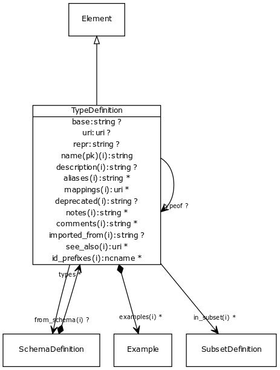

# Class: type definition

A data type definition.

URI: [http://w3id.org/biolink/biolinkml/meta/TypeDefinition](http://w3id.org/biolink/biolinkml/meta/TypeDefinition)

## Inheritance

 *  is_a: [Element](Element.md) - a named element in the model
## Children

## Used by

 *  **[TypeDefinition](TypeDefinition.md)** *[typeof](typeof.md)opt*  **[TypeDefinition](TypeDefinition.md)**
 *  **[SchemaDefinition](SchemaDefinition.md)** *[types](types.md)opt*  **[[TypeDefinition](TypeDefinition.md)]**
## Fields

 * [aliases](aliases.md)opt
    * range: [[String](String.md)]
    * inherited from: [Element](Element.md)
 * [base](base.md)opt
    * Description: python base type that implements this type definition
    * range: [String](String.md)
 * [comments](comments.md) *subsets*: (owl)opt
    * Description: notes and comments about an element intended for external consumption
    * range: [[String](String.md)]
    * inherited from: [Element](Element.md)
 * [deprecated](deprecated.md)opt
    * Description: Description of why and when this element will no longer be used
    * range: [String](String.md)
    * inherited from: [Element](Element.md)
 * [description](description.md) *subsets*: (owl)opt
    * Description: a description of the element's purpose and use
    * range: [String](String.md)
    * inherited from: [Element](Element.md)
 * [examples](examples.md) *subsets*: (owl)opt
    * Description: example usages of an element
    * range: [[Example](Example.md)]
    * inherited from: [Element](Element.md)
 * [from_schema](from_schema.md)opt
    * Description: id of the schema that defined the element
    * range: [SchemaDefinition](SchemaDefinition.md)
    * inherited from: [Element](Element.md)
 * [id_prefixes](id_prefixes.md)opt
    * Description: a list of Curie prefixes that are used in the representation of instances of the model.  All prefixes in this list are added to the prefix sections of the target models.
    * range: [[Ncname](Ncname.md)]
    * inherited from: [Element](Element.md)
 * [in_subset](in_subset.md)opt
    * Description: used to indicate membership of a term in a defined subset of biolink terms used for a particular domain or application (e.g. the translator_minimal subset holding the minimal set of predicates used in a translator knowledge graph)
    * range: [[SubsetDefinition](SubsetDefinition.md)]
    * inherited from: [Element](Element.md)
 * [mappings](mappings.md)opt
    * Description: A list of terms from different schemas or terminology systems that have comparable meaning. These may include terms that are precisely equivalent, broader or narrower in meaning, or otherwise semantically related but not equivalent from a strict ontological perspective.
    * range: [[Uri](Uri.md)]
    * inherited from: [Element](Element.md)
 * [name](name.md) *subsets*: (owl)
    * Description: the unique name of the element within the context of the schema
    * range: [String](String.md)
    * inherited from: [Element](Element.md)
 * [notes](notes.md) *subsets*: (owl)opt
    * Description: editorial notes about an element intended for internal consumption
    * range: [[String](String.md)]
    * inherited from: [Element](Element.md)
 * [see_also](see_also.md) *subsets*: (owl)opt
    * Description: a reference
    * range: [[Uri](Uri.md)]
    * inherited from: [Element](Element.md)
 * [type definition.uri](type_uri.md)opt
    * Description: the URI to be used for the type in semantic web mappings
    * range: [Uri](Uri.md)
 * [typeof](typeof.md)opt
    * Description: supertype
    * range: [TypeDefinition](TypeDefinition.md)
