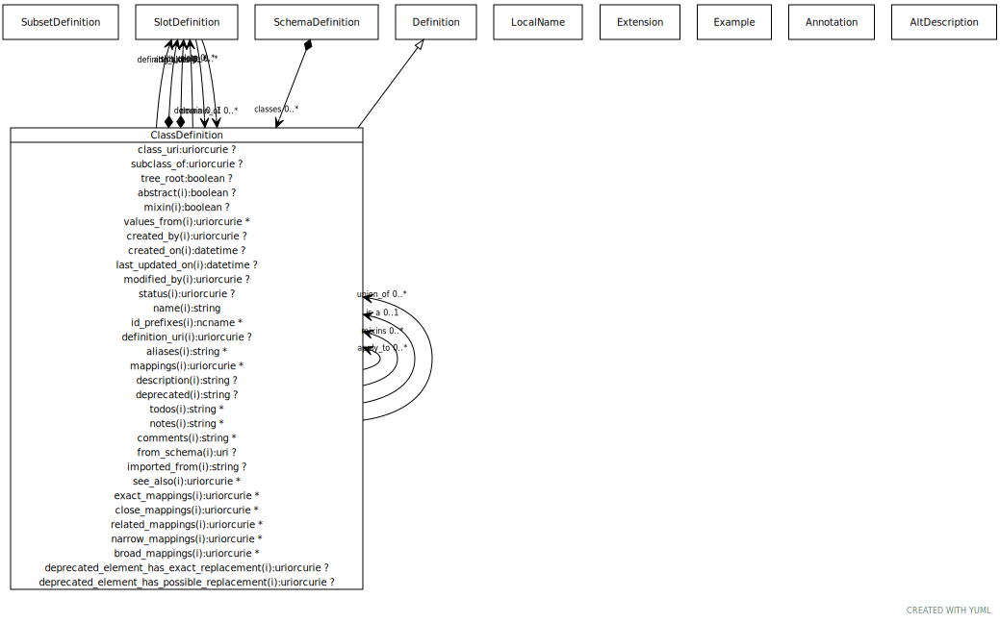

# Type: class_definition

the definition of a class or interface

URI: [meta:ClassDefinition](https://w3id.org/biolink/biolinkml/meta/ClassDefinition)

## Parents

 *  is_a: [Definition](Definition.md) - base class for definitions

## Referenced by class

 *  **[ClassDefinition](ClassDefinition.md)** *[class_definition➞apply_to](class_definition_apply_to.md)*  0..*  **[ClassDefinition](ClassDefinition.md)**
 *  **[ClassDefinition](ClassDefinition.md)** *[class_definition➞is_a](class_definition_is_a.md)*  OPT  **[ClassDefinition](ClassDefinition.md)**
 *  **[ClassDefinition](ClassDefinition.md)** *[class_definition➞mixins](class_definition_mixins.md)*  0..*  **[ClassDefinition](ClassDefinition.md)**
 *  **[SchemaDefinition](SchemaDefinition.md)** *[classes](classes.md)*  0..*  **[ClassDefinition](ClassDefinition.md)**
 *  **[SlotDefinition](SlotDefinition.md)** *[domain](domain.md)*  OPT  **[ClassDefinition](ClassDefinition.md)**
 *  **[SlotDefinition](SlotDefinition.md)** *[domain_of](domain_of.md)*  0..*  **[ClassDefinition](ClassDefinition.md)**
 *  **[ClassDefinition](ClassDefinition.md)** *[union_of](union_of.md)*  0..*  **[ClassDefinition](ClassDefinition.md)**

## Attributes

### Own

 * [attributes](attributes.md)  0..*
    * Description: Inline definition of slots
    * range: [SlotDefinition](SlotDefinition.md)
 * [class_definition➞apply_to](class_definition_apply_to.md)  0..*
    * range: [ClassDefinition](ClassDefinition.md)
 * [class_definition➞is_a](class_definition_is_a.md)  OPT
    * range: [ClassDefinition](ClassDefinition.md)
 * [class_definition➞mixins](class_definition_mixins.md)  0..*
    * range: [ClassDefinition](ClassDefinition.md)
 * [class_uri](class_uri.md)  OPT
    * Description: URI of the class in an RDF environment
    * range: [Uriorcurie](types/Uriorcurie.md)
 * [defining_slots](defining_slots.md)  0..*
    * Description: The combination of is a plus defining slots form a genus-differentia definition, or the set of necessary and sufficient conditions that can be transformed into an OWL equivalence axiom
    * range: [SlotDefinition](SlotDefinition.md)
 * [slot_usage](slot_usage.md)  0..*
    * Description: the redefinition of a slot in the context of the containing class definition.
    * range: [SlotDefinition](SlotDefinition.md)
 * [slots](slots.md)  0..*
    * Description: list of slot names that are applicable to a class
    * range: [SlotDefinition](SlotDefinition.md)
 * [subclass_of](subclass_of.md)  OPT
    * Description: rdfs:subClassOf to be emitted in OWL generation
    * range: [Uriorcurie](types/Uriorcurie.md)
 * [tree_root](tree_root.md)  OPT
    * Description: indicator that this is the root class in tree structures
    * range: [Boolean](types/Boolean.md)
 * [union_of](union_of.md)  0..*
    * Description: indicates that the domain class consists exactly of the members of the classes in the range
    * range: [ClassDefinition](ClassDefinition.md)

### Inherited from definition:

 * [abstract](abstract.md)  OPT
    * Description: an abstract class is a high level class or slot that is typically used to group common slots together and cannot be directly instantiated.
    * range: [Boolean](types/Boolean.md)
 * [aliases](aliases.md)  0..*
    * range: [String](types/String.md)
 * [alt_descriptions](alt_descriptions.md)  0..*
    * range: [AltDescription](AltDescription.md)
 * [broad mappings](broad_mappings.md)  0..*
    * Description: A list of terms from different schemas or terminology systems that have broader meaning.
    * range: [Uriorcurie](types/Uriorcurie.md)
 * [close mappings](close_mappings.md)  0..*
    * Description: A list of terms from different schemas or terminology systems that have close meaning.
    * range: [Uriorcurie](types/Uriorcurie.md)
 * [comments](comments.md)  0..*
    * Description: notes and comments about an element intended for external consumption
    * range: [String](types/String.md)
    * in subsets: (owl)
 * [created_by](created_by.md)  OPT
    * Description: agent that created the element
    * range: [Uriorcurie](types/Uriorcurie.md)
 * [created_on](created_on.md)  OPT
    * Description: time at which the element was created
    * range: [Datetime](types/Datetime.md)
 * [definition_uri](definition_uri.md)  OPT
    * Description: the "native" URI of the element
    * range: [Uriorcurie](types/Uriorcurie.md)
 * [deprecated](deprecated.md)  OPT
    * Description: Description of why and when this element will no longer be used
    * range: [String](types/String.md)
 * [deprecated element has exact replacement](deprecated_element_has_exact_replacement.md)  OPT
    * Description: When an element is deprecated, it can be automatically replaced by this uri or curie
    * range: [Uriorcurie](types/Uriorcurie.md)
 * [deprecated element has possible replacement](deprecated_element_has_possible_replacement.md)  OPT
    * Description: When an element is deprecated, it can be potentially replaced by this uri or curie
    * range: [Uriorcurie](types/Uriorcurie.md)
 * [description](description.md)  OPT
    * Description: a description of the element's purpose and use
    * range: [String](types/String.md)
    * in subsets: (owl)
 * [exact mappings](exact_mappings.md)  0..*
    * Description: A list of terms from different schemas or terminology systems that have identical meaning.
    * range: [Uriorcurie](types/Uriorcurie.md)
 * [examples](examples.md)  0..*
    * Description: example usages of an element
    * range: [Example](Example.md)
    * in subsets: (owl)
 * [from_schema](from_schema.md)  OPT
    * Description: id of the schema that defined the element
    * range: [Uri](types/Uri.md)
 * [id_prefixes](id_prefixes.md)  0..*
    * Description: the identifier of this class or slot must begin with one of the URIs referenced by this prefix
    * range: [Ncname](types/Ncname.md)
 * [imported_from](imported_from.md)  OPT
    * Description: the imports entry that this element was derived from.  Empty means primary source
    * range: [String](types/String.md)
 * [in_subset](in_subset.md)  0..*
    * Description: used to indicate membership of a term in a defined subset of biolink terms used for a particular domain or application (e.g. the translator_minimal subset holding the minimal set of predicates used in a translator knowledge graph)
    * range: [SubsetDefinition](SubsetDefinition.md)
 * [last_updated_on](last_updated_on.md)  OPT
    * Description: time at which the element was last updated
    * range: [Datetime](types/Datetime.md)
 * [local_names](local_names.md)  0..*
    * range: [LocalName](LocalName.md)
 * [mappings](mappings.md)  0..*
    * Description: A list of terms from different schemas or terminology systems that have comparable meaning. These may include terms that are precisely equivalent, broader or narrower in meaning, or otherwise semantically related but not equivalent from a strict ontological perspective.
    * range: [Uriorcurie](types/Uriorcurie.md)
 * [mixin](mixin.md)  OPT
    * Description: this slot or class can only be used as a mixin -- equivalent to abstract
    * range: [Boolean](types/Boolean.md)
 * [modified_by](modified_by.md)  OPT
    * Description: agent that modified the element
    * range: [Uriorcurie](types/Uriorcurie.md)
 * [name](name.md)  REQ
    * Description: the unique name of the element within the context of the schema.  Name is combined with the default prefix to form the globally unique subject of the target class.
    * range: [String](types/String.md)
    * in subsets: (owl)
 * [narrow mappings](narrow_mappings.md)  0..*
    * Description: A list of terms from different schemas or terminology systems that have narrower meaning.
    * range: [Uriorcurie](types/Uriorcurie.md)
 * [notes](notes.md)  0..*
    * Description: editorial notes about an element intended for internal consumption
    * range: [String](types/String.md)
    * in subsets: (owl)
 * [related mappings](related_mappings.md)  0..*
    * Description: A list of terms from different schemas or terminology systems that have related meaning.
    * range: [Uriorcurie](types/Uriorcurie.md)
 * [see_also](see_also.md)  0..*
    * Description: a reference
    * range: [Uriorcurie](types/Uriorcurie.md)
    * in subsets: (owl)
 * [status](status.md)  OPT
    * Description: status of the element
    * range: [Uriorcurie](types/Uriorcurie.md)
    * Example: bibo:draft None
 * [todos](todos.md)  0..*
    * Description: Outstanding issue that needs resolution
    * range: [String](types/String.md)
 * [values_from](values_from.md)  0..*
    * Description: the identifier of a "value set" -- a set of identifiers that form the possible values for the range of a slot
    * range: [Uriorcurie](types/Uriorcurie.md)

## Other properties

|  |  |  |
| --- | --- | --- |
| **Aliases:** | | table |
|  | | record |
|  | | template |

