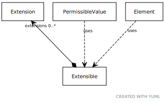

# Type: extensible

mixin for classes that support extension

URI: [meta:Extensible](https://w3id.org/biolink/biolinkml/meta/Extensible)

## Mixin for

 * [Element](Element.md) (mixin)  - a named element in the model

## Referenced by class

## Attributes

### Own

 * [extensions](extensions.md)  0..*
    * Description: a tag/text tuple attached to an arbitrary element
    * range: [Extension](Extension.md)
