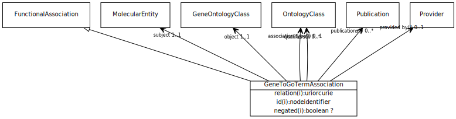

# Type: gene to go term association

URI: [biolink:GeneToGoTermAssociation](https://w3id.org/biolink/vocab/GeneToGoTermAssociation)

## Parents

 *  is_a: [FunctionalAssociation](FunctionalAssociation.md) - An association between a macromolecular machine (gene, gene product or complex of gene products) and either a molecular activity, a biological process or a cellular location in which a function is executed

## Referenced by class

## Attributes

### Own

 * [gene to go term association➞object](gene_to_go_term_association_object.md)  REQ
    * range: [GeneOntologyClass](GeneOntologyClass.md)
 * [gene to go term association➞subject](gene_to_go_term_association_subject.md)  REQ
    * range: [MolecularEntity](MolecularEntity.md)

### Inherited from functional association:

 * [association type](association_type.md)  OPT
    * Description: connects an association to the type of association (e.g. gene to phenotype)
    * range: [OntologyClass](OntologyClass.md)
 * [association➞id](association_id.md)  REQ
    * Description: A unique identifier for an association
    * range: [String](types/String.md)
    * in subsets: (translator_minimal)
 * [negated](negated.md)  OPT
    * Description: if set to true, then the association is negated i.e. is not true
    * range: [Boolean](types/Boolean.md)
 * [provided by](provided_by.md)  0..*
    * Description: connects an association to the agent (person, organization or group) that provided it
    * range: [Provider](Provider.md)
 * [publications](publications.md)  0..*
    * Description: connects an association to publications supporting the association
    * range: [Publication](Publication.md)
 * [qualifiers](qualifiers.md)  0..*
    * Description: connects an association to qualifiers that modify or qualify the meaning of that association
    * range: [OntologyClass](OntologyClass.md)
 * [relation](relation.md)  REQ
    * Description: the relationship type by which a subject is connected to an object in an association
    * range: [Uriorcurie](types/Uriorcurie.md)

## Other properties

|  |  |  |
| --- | --- | --- |
| **Aliases:** | | functional association |
| **Mappings:** | | http://bio2rdf.org/wormbase_vocabulary:Gene-GO-Association |

