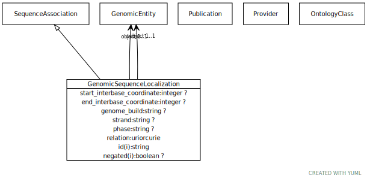

# Type: genomic sequence localization

A relationship between a sequence feature and an entity it is localized to. The reference entity may be a chromosome, chromosome region or information entity such as a contig

URI: [biolink:GenomicSequenceLocalization](https://w3id.org/biolink/vocab/GenomicSequenceLocalization)

## Parents

 *  is_a: [Association](Association.md) - A typed association between two entities, supported by evidence

## Referenced by class

## Attributes

### Own

 * [end interbase coordinate](end_interbase_coordinate.md)  OPT
    * range: [String](types/String.md)
 * [genome build](genome_build.md)  OPT
    * Description: TODO
    * range: [String](types/String.md)
 * [genomic sequence localization➞object](genomic_sequence_localization_object.md)  REQ
    * range: [GenomicEntity](GenomicEntity.md)
 * [genomic sequence localization➞subject](genomic_sequence_localization_subject.md)  REQ
    * range: [GenomicEntity](GenomicEntity.md)
 * [phase](phase.md)  OPT
    * Description: TODO
    * range: [String](types/String.md)
 * [start interbase coordinate](start_interbase_coordinate.md)  OPT
    * range: [String](types/String.md)

### Inherited from association:

 * [association type](association_type.md)  OPT
    * Description: connects an association to the type of association (e.g. gene to phenotype)
    * range: [OntologyClass](OntologyClass.md)
 * [association➞id](association_id.md)  REQ
    * Description: A unique identifier for an association
    * range: [String](types/String.md)
    * in subsets: (translator_minimal)
 * [negated](negated.md)  OPT
    * Description: if set to true, then the association is negated i.e. is not true
    * range: [Boolean](types/Boolean.md)
 * [provided by](provided_by.md)  0..*
    * Description: connects an association to the agent (person, organization or group) that provided it
    * range: [Provider](Provider.md)
 * [publications](publications.md)  0..*
    * Description: connects an association to publications supporting the association
    * range: [Publication](Publication.md)
 * [qualifiers](qualifiers.md)  0..*
    * Description: connects an association to qualifiers that modify or qualify the meaning of that association
    * range: [OntologyClass](OntologyClass.md)
 * [relation](relation.md)  REQ
    * Description: the relationship type by which a subject is connected to an object in an association
    * range: [Uriorcurie](types/Uriorcurie.md)

## Other properties

|  |  |  |
| --- | --- | --- |
| **Mappings:** | | faldo:location |

