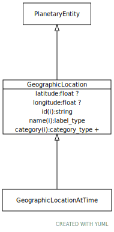

# Type: geographic location

a location that can be described in lat/long coordinates

URI: [biolink:GeographicLocation](https://w3id.org/biolink/vocab/GeographicLocation)

## Parents

 *  is_a: [PlanetaryEntity](PlanetaryEntity.md) - Any entity or process that exists at the level of the whole planet

## Children

 * [GeographicLocationAtTime](GeographicLocationAtTime.md) - a location that can be described in lat/long coordinates, for a particular time

## Referenced by class

## Attributes

### Own

 * [latitude](latitude.md)  OPT
    * Description: latitude
    * range: [Float](types/Float.md)
 * [longitude](longitude.md)  OPT
    * Description: longitude
    * range: [Float](types/Float.md)

### Inherited from planetary entity:

 * [category](category.md)  1..*
    * Description: Name of the high level ontology class in which this entity is categorized. Corresponds to the label for the biolink entity type class. In a neo4j database this MAY correspond to the neo4j label tag
    * range: [CategoryType](types/CategoryType.md)
    * in subsets: (translator_minimal)
 * [id](id.md)  REQ
    * Description: A unique identifier for a thing. Must be either a CURIE shorthand for a URI or a complete URI
    * range: [String](types/String.md)
    * in subsets: (translator_minimal)
 * [name](name.md)  REQ
    * Description: A human-readable name for a thing
    * range: [LabelType](types/LabelType.md)
    * in subsets: (translator_minimal)

## Other properties

|  |  |  |
| --- | --- | --- |
| **Mappings:** | | UMLSSG:GEOG |
|  | | UMLSST:geoa |
|  | | UMLSSC:T083 |

