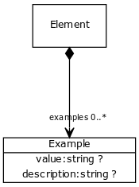

# Class: example

usage example and description

URI: [meta:Example](https://w3id.org/biolink/biolinkml/meta/Example)

## Referenced by class

 *  **[Element](Element.md)** *[examples](examples.md)*  0..*  **[Example](Example.md)**

## Attributes

### Own

 * value  OPT
    * Description: example value
    * range: [String](String.md)
 * value_description  OPT
    * Description: description of what the value is doing
    * range: [String](String.md)

### Domain for slot:

 * value  OPT
    * Description: example value
    * range: [String](String.md)
 * value_description  OPT
    * Description: description of what the value is doing
    * range: [String](String.md)
